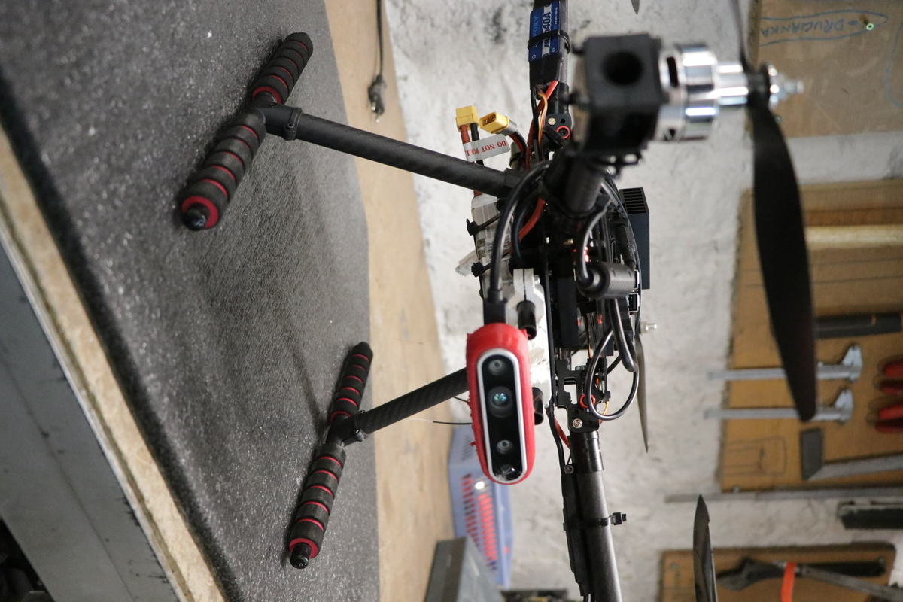
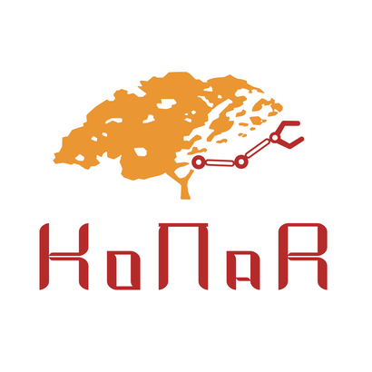

# KoNaR Becard
A autonomous UAV project developed by students from Stundents Interest Group "KoNaR" at Wrocław University of Science and Technology.

# Contact

* Webpage [KoNaR](https://konar.pwr.edu.pl/)
* E-mail [konarrobotics@gmail.com](konarrobotics@gmail.com)

